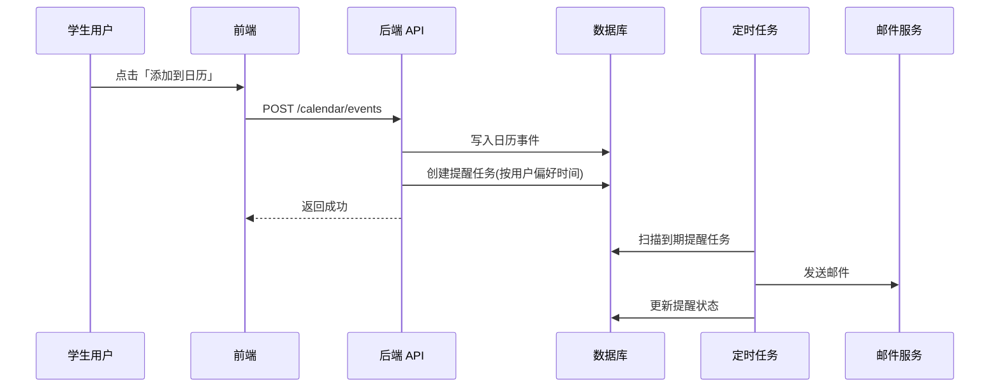

# Employment Center Campus Recruitment Information Platform
# 就业中心校招信息平台 — 项目说明书

| 文档属性 | 内容 |
| --- | --- |
| 文档版本 | v1.0 |
| 编写日期 | 2026-06-06 |
| 文档状态 | 初稿 |
| 密级 | 内部公开 |
| 适用对象 | 项目组、指导教师、就业指导中心、评审方 |

---

## 修订记录

| 版本 | 日期 | 修订人 | 修订说明 |
| --- | --- | --- | --- |
| v1.0 | 2026-06-06 | 项目组 | 初版，完成需求梳理与开发计划 |

---

## 目录

1. [项目概述](#1-项目概述)
2. [项目背景与目标](#2-项目背景与目标)
3. [项目范围](#3-项目范围)
4. [用户角色与权限](#4-用户角色与权限)
5. [功能需求](#5-功能需求)
6. [非功能需求](#6-非功能需求)
7. [系统架构设计](#7-系统架构设计)
8. [技术选型建议](#8-技术选型建议)
9. [数据设计概要](#9-数据设计概要)
10. [接口设计概要](#10-接口设计概要)
11. [业务流程说明](#11-业务流程说明)
12. [开发计划与里程碑](#12-开发计划与里程碑)
13. [测试方案](#13-测试方案)
14. [部署与运维方案](#14-部署与运维方案)
15. [风险识别与应对](#15-风险识别与应对)
16. [交付物清单](#16-交付物清单)
17. [验收标准](#17-验收标准)
18. [附录](#18-附录)

---

## 1. 项目概述

### 1.1 项目名称

就业中心校招信息平台（Employment Center Campus Recruitment Information Platform）

### 1.2 项目定位

本平台面向高校就业指导中心，以学校官网发布的校招信息为数据源，为学生提供**个性化宣讲会/双选会推荐、日程管理与邮件提醒**的一体化服务，解决校招信息分散、学生筛选成本高、重要活动易遗漏等问题。

### 1.3 项目价值

| 受益方 | 价值说明 |
| --- | --- |
| 学生 | 获取与自身专业、意向岗位匹配的校招信息；统一管理宣讲会/双选会日程；按时收到邮件提醒 |
| 就业指导中心 | 提升就业信息发布触达率；减少重复咨询；形成可追踪的学生参与数据 |
| 学校 | 提升就业服务质量与数字化水平；支撑就业数据统计与分析 |

---

## 2. 项目背景与目标

### 2.1 背景说明

当前高校就业信息主要通过就业指导中心官网集中发布，信息量大、更新频繁。学生需要自行浏览、筛选宣讲会与双选会，存在以下痛点：

- 信息过载，难以快速找到与自身相关的活动
- 多个活动时间冲突时缺乏统一规划工具
- 容易错过报名时间或举办时间
- 缺乏基于学院、专业、意向岗位的个性化推荐

### 2.2 项目目标

| 编号 | 目标 | 衡量指标（建议） |
| --- | --- | --- |
| G1 | 实现校招信息的结构化采集与展示 | 支持宣讲会、双选会两类信息的完整字段展示 |
| G2 | 实现基于学生画像的个性化推荐 | 推荐结果与学生意向岗位/偏好城市/关注公司相关度可感知 |
| G3 | 实现日程管理与多粒度提醒 | 支持添加/修改/删除日历事件；提醒准时率 ≥ 95% |
| G4 | 提升学生活动参与率 | 相较纯官网浏览，平台内「添加到日历」转化率可统计 |

### 2.3 项目约束

- 数据来源以学校就业指导中心官网发布内容为准，需遵守学校数据使用规范
- 项目开发周期有限，优先保障核心链路（注册登录 → 信息浏览 → 推荐 → 日历 → 邮件提醒）
- 初期以 Web 端为主，移动端适配为增强项

---

## 3. 项目范围

### 3.1 范围内（In Scope）

- 学生用户注册、登录与个人资料管理
- 宣讲会、双选会信息的展示与检索
- 基于学生画像的个性化推荐
- 日历事件的添加、修改、删除（时间可不互斥）
- 邮件提醒（支持提前 1 小时 / 1 天 / 3 天）
- 个性化偏好设置（意向岗位、偏好城市、偏好公司、特别关注公司）
- 就业中心官网信息的定时/手动同步（采集方案视官网结构而定）

### 3.2 范围外（Out of Scope，本期不做）

- 企业端自助发布校招信息
- 在线简历投递与 ATS 系统集成
- 即时消息（短信/微信/APP Push）提醒
- 复杂 AI 对话式职业咨询
- 多校区、多租户 SaaS 化部署

---

## 4. 用户角色与权限

| 角色 | 描述 | 核心权限 |
| --- | --- | --- |
| 学生用户 | 平台主要使用者 | 维护个人资料与偏好；浏览/检索校招信息；查看推荐；管理个人日历；接收邮件提醒 |
| 系统管理员 | 就业中心或项目组运维人员 | 用户管理；信息源配置；数据同步监控；系统参数配置（如提醒模板） |
| 访客（可选） | 未登录用户 | 浏览公开校招信息列表（不含个性化推荐与日历功能） |

### 4.1 权限原则

- 学生仅能访问和操作本人数据（个人资料、偏好、日历）
- 管理员操作需记录审计日志
- 敏感信息（邮箱、学号等）需脱敏展示与加密存储

---

## 5. 功能需求

### 5.1 功能模块总览

```
┌─────────────────────────────────────────────────────────┐
│                    就业中心校招信息平台                    │
├──────────┬──────────┬──────────┬──────────┬─────────────┤
│ 用户中心  │ 信息浏览  │ 智能推荐  │ 日历管理  │  消息提醒   │
├──────────┼──────────┼──────────┼──────────┼─────────────┤
│ 注册登录  │ 宣讲会列表 │ 推荐列表  │ 添加日程  │ 邮件模板   │
│ 个人资料  │ 双选会列表 │ 推荐规则  │ 修改日程  │ 定时任务   │
│ 偏好设置  │ 详情查看  │ 筛选排序  │ 删除日程  │ 提醒记录   │
└──────────┴──────────┴──────────┴──────────┴─────────────┘
```

### 5.2 用户中心模块

#### FR-UC-001 用户注册与登录

- **描述**：学生通过邮箱/学号（视学校统一认证情况而定）注册并登录系统
- **输入**：账号、密码、验证码（可选）
- **输出**：登录态 Token、用户基本信息
- **规则**：
  - 密码需满足复杂度要求（长度 ≥ 8，含字母与数字）
  - 登录失败连续 5 次锁定账号 15 分钟（可配置）
  - 支持「记住登录」与退出登录

#### FR-UC-002 个人资料管理

- **描述**：学生上传并维护个人就业相关信息
- **字段**：

| 字段 | 类型 | 必填 | 说明 |
| --- | --- | --- | --- |
| 姓名 | 文本 | 是 | 真实姓名 |
| 学院 | 下拉/文本 | 是 | 所属学院 |
| 专业 | 下拉/文本 | 是 | 所属专业 |
| 年级 | 下拉 | 否 | 如 2022 级 |
| 就业意向岗位 | 多选/文本 | 是 | 如 Java 开发、产品经理 |
| 联系电话 | 文本 | 否 | 用于扩展通知 |
| 邮箱 | 邮箱 | 是 | 用于邮件提醒 |

#### FR-UC-003 个性化偏好设置

- **描述**：学生可定制推荐与提醒相关偏好
- **可配置项**：
  - 意向岗位（多选）
  - 偏好城市（多选）
  - 偏好公司（多选）
  - 特别关心的公司（多选，权重更高）
  - 日历提醒时间：提前 1 小时 / 提前 1 天 / 提前 3 天（单选或多选，默认提前 1 天）

### 5.3 校招信息浏览模块

#### FR-INFO-001 宣讲会信息展示

- **描述**：展示从就业中心官网同步的宣讲会信息
- **核心字段**：标题、举办公司、举办时间、举办地点、面向专业/岗位、报名链接、信息来源 URL、发布时间
- **功能**：列表浏览、关键词搜索、按时间/公司筛选、详情页查看

#### FR-INFO-002 双选会信息展示

- **描述**：展示双选会（大型招聘会）信息
- **核心字段**：名称、举办日期、举办地点、参与企业数量（如有）、面向对象、报名截止时间、详情链接
- **功能**：同宣讲会，支持按日期区间筛选

#### FR-INFO-003 信息同步

- **描述**：从就业指导中心官网采集/同步最新就业信息
- **方式**（择一或组合）：
  - 定时爬虫 + 人工校验
  - 管理员手动录入/导入
  - 若官网提供 RSS/API，优先对接官方接口
- **要求**：记录同步时间与数据版本，支持增量更新

### 5.4 智能推荐模块

#### FR-REC-001 个性化推荐列表

- **描述**：根据学生学院、专业、就业意向岗位及偏好设置，生成推荐表单/列表
- **推荐逻辑（初版规则引擎）**：

| 匹配维度 | 权重建议 | 说明 |
| --- | --- | --- |
| 意向岗位 | 高 | 活动标签/岗位关键词与学生意向匹配 |
| 特别关心公司 | 高 | 举办公司命中则优先展示 |
| 偏好公司 | 中 | 举办公司在偏好列表中 |
| 偏好城市 | 中 | 举办地点城市匹配 |
| 学院/专业 | 中 | 活动面向对象包含该学院/专业 |
| 时间临近度 | 低 | 即将开始的活动适当靠前 |

- **输出**：推荐列表，展示匹配原因（如「匹配您的意向岗位：Java 开发」）
- **扩展**：后续可引入协同过滤或 Embedding 语义匹配

#### FR-REC-002 推荐结果交互

- 支持一键「添加到日历」
- 支持标记「不感兴趣」（用于优化推荐，可选）

### 5.5 日历管理模块

#### FR-CAL-001 添加到日历

- **描述**：学生对感兴趣的宣讲会/双选会执行「添加到日历」，该日程加入个人日历
- **规则**：
  - 同一活动可被多次添加的情况需去重（同一用户 + 同一活动 ID 仅保留一条）
  - **时间可不互斥**：多个日程可在同一时间段并存，系统不做冲突拦截，仅可选提示
  - 添加成功后自动生成对应邮件提醒任务

#### FR-CAL-002 日历查看

- **视图**：月视图、周视图、列表视图（至少实现列表 + 月视图其一）
- **展示内容**：活动名称、类型（宣讲会/双选会）、时间、地点、提醒状态

#### FR-CAL-003 日历修改

- **描述**：用户可修改已添加日程的部分属性
- **可修改项**：个人备注、提醒时间偏好（覆盖全局默认）
- **不可修改项**：活动原始时间、地点（以信息源为准，若官网更新则同步更新并通知用户）

#### FR-CAL-004 日历删除

- **描述**：用户可删除已添加的日程
- **规则**：删除后取消未发送的邮件提醒任务；已发送提醒保留历史记录

### 5.6 消息提醒模块

#### FR-NOTIFY-001 邮件提醒

- **描述**：在日程开始前，按用户设置的提前时间发送邮件提醒
- **提醒粒度**：提前 1 小时 / 提前 1 天 / 提前 3 天
- **邮件内容**：活动名称、类型、开始时间、地点、详情链接、取消订阅说明
- **发送机制**：
  - 后端定时任务扫描待提醒日程（建议每 5–15 分钟执行一次）
  - 同一日程同一提醒粒度仅发送一次
  - 发送失败支持重试（最多 3 次，指数退避）

#### FR-NOTIFY-002 提醒记录

- 用户可查看历史提醒发送记录（时间、状态：成功/失败）

---

## 6. 非功能需求

### 6.1 性能需求

| 指标 | 要求 |
| --- | --- |
| 页面首屏加载 | ≤ 3 秒（常规网络） |
| 接口响应时间 | 95% 请求 ≤ 500 ms |
| 并发用户 | 支持 ≥ 200 在线用户（课设/校级规模） |
| 邮件提醒延迟 | 相对计划提醒时间误差 ≤ 10 分钟 |

### 6.2 可用性需求

- 核心功能（浏览、推荐、添加日历）3 步内可达
- 界面简洁，符合高校学生使用习惯
- 关键操作有明确成功/失败反馈
- 支持主流浏览器：Chrome、Edge、Firefox 最新两个大版本

### 6.3 安全需求

- 全站 HTTPS（生产环境）
- 密码 BCrypt/Argon2 加密存储
- 接口鉴权采用 JWT 或 Session + CSRF 防护
- 防止 SQL 注入、XSS、CSRF 等常见 Web 攻击
- 邮件内容不包含敏感 Token；链接需校验权限

### 6.4 可靠性需求

- 服务可用性目标：≥ 99%（演示/答辩期间）
- 数据库每日自动备份
- 关键业务操作（登录、添加日历、发送邮件）记录日志

### 6.5 可维护性需求

- 前后端分离，接口文档完整（Swagger/OpenAPI）
- 代码规范统一，关键模块有单元测试
- 配置与代码分离（数据库、邮件 SMTP、同步策略等）

### 6.6 兼容性需求

- 前端响应式布局，适配 1280px 及以上桌面端；移动端基础可读（增强项）
- 后端支持 Docker 部署

---

## 7. 系统架构设计

### 7.1 总体架构

采用**前后端分离 + 分层架构**：

```
┌──────────────┐     HTTPS/REST      ┌──────────────┐
│   Web 前端    │ ◄─────────────────► │   后端 API    │
│  (Vue/React)  │                     │ (Spring Boot) │
└──────────────┘                     └──────┬───────┘
                                            │
                    ┌───────────────────────┼───────────────────────┐
                    │                       │                       │
              ┌─────▼─────┐           ┌───────▼───────┐       ┌───────▼───────┐
              │   MySQL   │           │  Redis (可选)  │       │  邮件服务 SMTP │
              │  业务数据库 │           │  缓存/任务锁   │       │               │
              └───────────┘           └───────────────┘       └───────────────┘
                                            │
                                    ┌───────▼───────┐
                                    │  定时任务调度   │
                                    │ 信息同步/邮件提醒 │
                                    └───────────────┘
```

### 7.2 逻辑分层

| 层级 | 职责 |
| --- | --- |
| 表现层 | 页面渲染、交互、路由、状态管理 |
| 接口层 | REST API、参数校验、鉴权、统一响应 |
| 业务层 | 推荐规则、日历逻辑、提醒调度 |
| 数据访问层 | ORM 映射、事务管理 |
| 基础设施层 | 邮件、爬虫/同步、日志、配置 |

### 7.3 核心模块交互（添加日历 → 邮件提醒）



---

## 8. 技术选型建议

> 以下为推荐方案，实施时可根据团队技术栈微调，但需在《技术方案说明》中备案。

| 层次 | 推荐技术 | 说明 |
| --- | --- | --- |
| 前端 | Vue 3 + Vite + Element Plus | 组件丰富，适合管理型与表单型页面 |
| 后端 | Spring Boot 3 + MyBatis-Plus | 生态成熟，适合 REST 与定时任务 |
| 数据库 | MySQL 8.0 | 关系型数据，支持事务 |
| 缓存 | Redis（可选） | 推荐结果缓存、分布式锁 |
| 定时任务 | Spring Scheduler / Quartz | 信息同步与邮件提醒 |
| 邮件 | JavaMail + 学校 SMTP 或第三方服务 | 开发期可用 MailHog/Mailtrap 模拟 |
| 接口文档 | Knife4j (Swagger) | 自动生成 API 文档 |
| 部署 | Docker + Docker Compose | 一键启动前后端与数据库 |
| 版本管理 | Git + GitHub/Gitee | 分支策略见 12.3 |

---

## 9. 数据设计概要

### 9.1 核心实体

| 实体 | 说明 | 主要字段 |
| --- | --- | --- |
| User（用户） | 学生账号 | id, username, password_hash, email, college, major, grade, status |
| UserPreference（用户偏好） | 个性化设置 | user_id, target_positions, preferred_cities, preferred_companies, focus_companies, remind_before |
| CareerTalk（宣讲会） | 宣讲会信息 | id, title, company, start_time, location, positions, source_url, synced_at |
| JobFair（双选会） | 双选会信息 | id, title, start_date, end_date, location, deadline, source_url, synced_at |
| CalendarEvent（日历事件） | 用户日程 | id, user_id, event_type, ref_id, custom_note, remind_before, status |
| ReminderLog（提醒记录） | 邮件发送记录 | id, calendar_event_id, scheduled_time, sent_time, status, retry_count |

### 9.2 ER 关系（概要）

```
User 1 ──── 1 UserPreference
User 1 ──── N CalendarEvent
CalendarEvent N ──── 1 CareerTalk / JobFair (通过 event_type + ref_id 关联)
CalendarEvent 1 ──── N ReminderLog
```

### 9.3 索引建议

- `calendar_event(user_id, start_time)`：日历查询
- `reminder_log(status, scheduled_time)`：待发送提醒扫描
- `career_talk(start_time)`、`job_fair(start_date)`：按时间筛选

---

## 10. 接口设计概要

### 10.1 接口规范

- 风格：RESTful
- 前缀：`/api/v1`
- 统一响应：

```json
{
  "code": 0,
  "message": "success",
  "data": {}
}
```

- 错误码：`0` 成功；`4xx` 客户端错误；`5xx` 服务端错误

### 10.2 核心接口列表

| 模块 | 方法 | 路径 | 说明 |
| --- | --- | --- | --- |
| 认证 | POST | `/auth/register` | 注册 |
| 认证 | POST | `/auth/login` | 登录 |
| 用户 | GET/PUT | `/users/me` | 获取/更新个人资料 |
| 偏好 | GET/PUT | `/users/me/preferences` | 获取/更新偏好设置 |
| 宣讲会 | GET | `/career-talks` | 列表（分页、筛选） |
| 宣讲会 | GET | `/career-talks/{id}` | 详情 |
| 双选会 | GET | `/job-fairs` | 列表 |
| 双选会 | GET | `/job-fairs/{id}` | 详情 |
| 推荐 | GET | `/recommendations` | 个性化推荐列表 |
| 日历 | GET | `/calendar/events` | 我的日历 |
| 日历 | POST | `/calendar/events` | 添加到日历 |
| 日历 | PUT | `/calendar/events/{id}` | 修改日程 |
| 日历 | DELETE | `/calendar/events/{id}` | 删除日程 |
| 提醒 | GET | `/reminders/logs` | 提醒记录 |
| 管理 | POST | `/admin/sync` | 触发信息同步（管理员） |

---

## 11. 业务流程说明

### 11.1 学生使用主流程

1. 注册/登录平台
2. 完善学院、专业、就业意向岗位等个人信息
3. 设置偏好城市、偏好公司、提醒时间等个性化选项
4. 浏览推荐列表或主动检索宣讲会/双选会
5. 对感兴趣活动点击「添加到日历」
6. 在日历中查看、修改备注或删除日程
7. 系统在活动开始前按设定时间发送邮件提醒

### 11.2 信息同步流程

1. 定时任务或管理员手动触发同步
2. 从就业中心官网抓取/导入最新数据
3. 解析、去重、入库
4. 若已入库活动的关键字段（时间、地点）变更，更新源数据并标记受影响日历事件
5. （可选）向相关用户发送「活动信息变更通知」

### 11.3 邮件提醒流程

1. 用户添加日历时，根据 `remind_before` 计算 `scheduled_time`
2. 定时任务扫描 `scheduled_time <= now` 且未发送的记录
3. 调用 SMTP 发送邮件
4. 更新状态；失败则按策略重试并记录日志

---

## 12. 开发计划与里程碑

### 12.1 阶段划分

| 阶段 | 时间 | 目标 | 主要产出 |
| --- | --- | --- | --- |
| 第一阶段：需求分析与 UI 设计 | 6.6 – 6.8 | 明确需求、原型与视觉规范 | 需求说明书、原型图、UI 规范、数据库设计 |
| 第二阶段：前后端协同开发 | 6.9 – 6.14 | 完成核心功能开发 | 可运行前后端、接口文档、核心模块代码 |
| 第三阶段：测试与部署 | 6.15 – 6.16 | 质量保障与上线 | 测试报告、部署文档、修复记录 |
| 第四阶段：成果物交付 | 6.21 – 6.23 | 答辩与归档 | 最终代码、文档、演示视频/ PPT |

### 12.2 迭代计划（第二阶段细化）

| 迭代 | 时间 | 后端 | 前端 |
| --- | --- | --- | --- |
| Sprint 1 | 6.9 – 6.10 | 用户认证、个人资料 API；数据库建表 | 登录注册、个人中心页面 |
| Sprint 2 | 6.11 – 6.12 | 宣讲会/双选会 CRUD、信息同步骨架 | 信息列表、详情、搜索筛选 |
| Sprint 3 | 6.13 – 6.14 | 推荐引擎、日历 CRUD、邮件提醒任务 | 推荐页、日历页、偏好设置 |

### 12.3 分支策略

- `main`：稳定可发布版本
- `develop`：日常集成分支
- `feature/*`：功能分支，完成后合并至 `develop`
- `fix/*`：缺陷修复分支

### 12.4 协作规范

- 每日站会同步进度与阻塞项
- 接口变更需更新 Swagger 并通知前端
- Code Review 后合并，禁止直接推送到 `main`

---

## 13. 测试方案

### 13.1 测试类型

| 类型 | 范围 | 负责人 |
| --- | --- | --- |
| 单元测试 | 推荐算法、日历逻辑、提醒时间计算 | 后端 |
| 接口测试 | 全部 REST API | 后端/测试 |
| 功能测试 | 端到端业务流程 | 全员 |
| 兼容性测试 | 主流浏览器 | 前端 |
| 安全测试 | 鉴权、注入、越权 | 后端 |

### 13.2 核心测试用例（示例）

| 编号 | 场景 | 预期结果 |
| --- | --- | --- |
| TC-001 | 未登录访问推荐接口 | 返回 401 |
| TC-002 | 完善意向岗位后查看推荐 | 推荐列表含匹配活动 |
| TC-003 | 同一活动重复添加日历 | 仅一条记录，提示已存在 |
| TC-004 | 添加多个时间重叠日程 | 均成功添加，无互斥拦截 |
| TC-005 | 删除日历事件 | 对应未发送提醒任务取消 |
| TC-006 | 提醒任务到期 | 准时收到邮件，状态更新为已发送 |
| TC-007 | 修改提醒时间为「提前 3 天」 | 新添加日程按新规则生成提醒 |

### 13.3 缺陷管理

- 缺陷分级：P0（阻塞）/ P1（严重）/ P2（一般）/ P3（建议）
- P0、P1 必须在部署前修复；测试报告需附缺陷统计与关闭率

---

## 14. 部署与运维方案

### 14.1 部署架构（建议）

```
                    ┌─────────────┐
   用户浏览器 ──────►│   Nginx     │  静态资源 + 反向代理
                    └──────┬──────┘
                           │
              ┌────────────┼────────────┐
              ▼                         ▼
       ┌─────────────┐           ┌─────────────┐
       │  前端静态资源 │           │  后端 API    │
       └─────────────┘           └──────┬──────┘
                                        │
                                 ┌──────▼──────┐
                                 │   MySQL     │
                                 └─────────────┘
```

### 14.2 环境划分

| 环境 | 用途 | 说明 |
| --- | --- | --- |
| dev | 本地开发 | 使用 MailHog 模拟邮件 |
| test | 集成测试 | 与生产配置隔离 |
| prod | 演示/上线 | 正式 SMTP、HTTPS 证书 |

### 14.3 配置项清单

- 数据库连接、JWT 密钥
- SMTP 服务器、发件人账号
- 信息源 URL、同步 Cron 表达式
- 日志级别与日志路径

### 14.4 监控与日志

- 应用日志：按天滚动，保留 30 天
- 监控指标：接口错误率、邮件发送成功率、定时任务执行情况
- 告警（可选）：邮件发送连续失败时通知管理员

---

## 15. 风险识别与应对

| 风险 | 可能性 | 影响 | 应对措施 |
| --- | --- | --- | --- |
| 官网结构变更导致爬虫失效 | 中 | 高 | 预留手动导入；解析层抽象；同步失败告警 |
| 邮件被识别为垃圾邮件 | 中 | 中 | 使用学校官方 SMTP；规范邮件模板与发件人 |
| 开发周期紧张导致功能裁剪 | 高 | 中 | 按 MoSCoW 优先级交付：Must → Should → Could |
| 推荐效果不明显 | 中 | 低 | 初版规则引擎 + 展示匹配原因；预留算法升级接口 |
| 日历与官网时间不一致 | 低 | 中 | 以官网为准定期同步；变更加推送通知 |
| 团队成员技术栈不一致 | 中 | 中 | 提前确定技术方案；接口先行；文档同步 |

### 15.1 功能优先级（MoSCoW）

| 优先级 | 功能 |
| --- | --- |
| **Must** | 登录注册、个人资料、信息浏览、添加/删除日历、邮件提醒 |
| **Should** | 个性化推荐、偏好设置、日历修改、提醒记录 |
| **Could** | 月视图日历、信息变更通知、推荐反馈 |
| **Won't（本期）** | 短信提醒、企业端、AI 咨询 |

---

## 16. 交付物清单

| 序号 | 交付物 | 格式 | 说明 |
| --- | --- | --- | --- |
| 1 | 项目说明书 | Markdown/PDF | 本文档 |
| 2 | 需求规格说明书（SRS） | Markdown/PDF | 可基于本文档第五章细化 |
| 3 | 数据库设计文档 | Markdown + DDL | 表结构、索引、ER 图 |
| 4 | 接口文档 | Swagger/在线文档 | 可访问的 API 说明 |
| 5 | 源代码 | Git 仓库 | 含 README 与启动说明 |
| 6 | 部署文档 | Markdown | 环境要求、部署步骤 |
| 7 | 测试报告 | Markdown/PDF | 用例、结果、缺陷统计 |
| 8 | 用户手册 | Markdown/PDF | 学生端操作指南 |
| 9 | 演示 PPT / 视频 | PPT / MP4 | 答辩使用 |

---

## 17. 验收标准

### 17.1 功能验收

- [ ] 学生可完成注册、登录、资料与偏好维护
- [ ] 宣讲会、双选会信息可正常浏览与检索
- [ ] 推荐列表能体现学生意向岗位/偏好差异
- [ ] 「添加到日历」功能正常，重复添加去重
- [ ] 日历支持修改（备注/提醒）与删除
- [ ] 邮件提醒按设定提前时间准确发送
- [ ] 多个日程时间重叠时不互斥，均可正常管理

### 17.2 非功能验收

- [ ] 核心页面加载与接口响应满足第 6 章指标
- [ ] 通过基本安全测试（未授权访问、SQL 注入防护）
- [ ] 提供完整部署文档，可在新环境完成部署
- [ ] 代码仓库结构清晰，README 可指导他人运行项目

### 17.3 文档验收

- [ ] 交付物清单中 Must 项文档齐全
- [ ] 文档版本与代码版本一致

---

## 18. 附录

### 18.1 术语表

| 术语 | 说明 |
| --- | --- |
| 宣讲会 | 企业在校园内或线上举办的招聘宣传与面试活动 |
| 双选会 | 大型校园招聘会，多家企业与学生双向选择 |
| 学生画像 | 基于学院、专业、意向岗位、偏好等形成的用户特征 |
| 提醒粒度 | 邮件提前发送的时间间隔（1 小时/1 天/3 天） |

### 18.2 参考文档

- 学校就业指导中心官网（信息源）
- 《软件需求规格说明规范》GB/T 9385
- 项目组内部编码规范与 Git 协作规范（待补充）

### 18.3 待确认事项

| 编号 | 事项 | 确认方 | 状态 |
| --- | --- | --- | --- |
| O-001 | 是否对接学校统一身份认证（SSO） | 就业中心/信息中心 | 待确认 |
| O-002 | 就业官网是否允许自动化采集 | 就业中心 | 待确认 |
| O-003 | 正式邮件 SMTP 账号与发件规范 | 就业中心 | 待确认 |
| O-004 | 学院/专业数据是否提供标准字典 | 就业中心 | 待确认 |

---

**文档结束**
